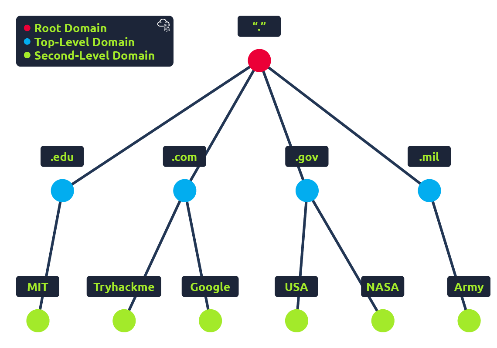
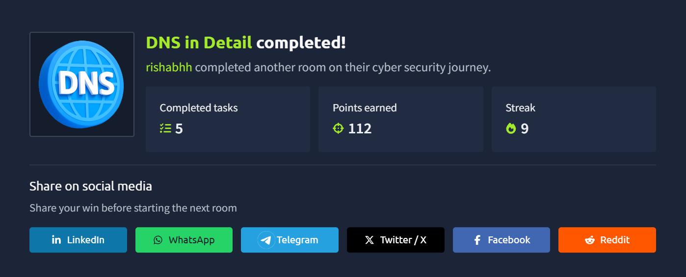

# DNS in Detail

## What is DNS?

DNS (Domain Name System) provides a simple way for us to communicate with devices on the internet without remembering complex numbers. Much like every house has a unique address for sending mail directly to it, every computer on the internet has its own unique address to communicate with it called an IP address.

An IP address looks like the following 104.26.10.229, 4 sets of digits ranging from 0 - 255 separated by a period. When you want to visit a website, it's not exactly convenient to remember this complicated set of numbers, and that's where DNS can help. So instead of remembering 104.26.10.229, you can remember tryhackme.com instead.

### Domain Hierarchy

1. **Top Level Domain(TLD)**

- Their are two type of TLD, gTLD (Deneric Top Level Domain) and ccTLD (Country Code Top Level Domain).
- gTLD tell the user what is the purpose of domain name like .com for commercial, .ed for education.
- ccTLD was used fo geographical purpose like .co.uk based on united kingdom.

1. **Second Level Domain**

- For example rishabh.com so .com is TLD and rishabh is second level domain.
- The second-level limited to **63 Char + the TLD** and can only use **a-z 0-9** and **hyphens** (Not **start** and **end** with hyphen).

1. **Subdomain**

- The subdomain is Left-hand side domain using period(.) to separate it. example raj.rishabh.com so raj is a subdomain.
- There is no limit to the number of subdomains you can create for your domain name but **remember total length of DNS is 253 character include Root, TDL, second level, and subdomain**.

## DNS Record Types

- **A Record:** This records resolve to **IPv4 addressing**, like **104.222.32.9**
- **AAAA:** These records resolve to **IPv6 addresses**, for example **2606:4700:20::681a:be5**
- **CNAME Record:** These records resolve to another domain name, for example, TryHackMe's online shop has the subdomain name store.tryhackme.com which returns a **CNAME record** shops.shopify.com Another DNS request would then be made to shops.shopify.com to work out the IP address.
- **MX Record:** These records resolve to the address of the servers that handle the email for the domain you are querying, for example an MX record response for tryhackme.com would look something like alt1.aspmx.l.google.com
- **TXT Record:** TXT records are free text fields where any text-based data can be stored.

## Making A Request

