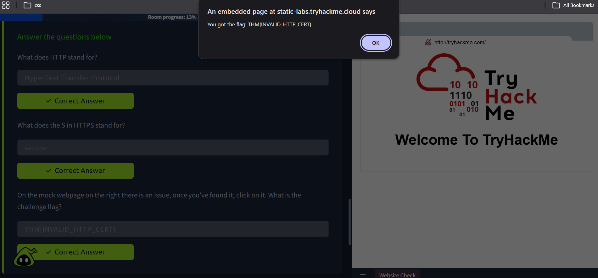

# HTTP in detail - How the web works

HTTP(HyperText Transfer Protocol) is the protocol that specific how a web browser and a web server communicate. Your web browser requests content from the Tryhackme web server using the HTTP protocol.

