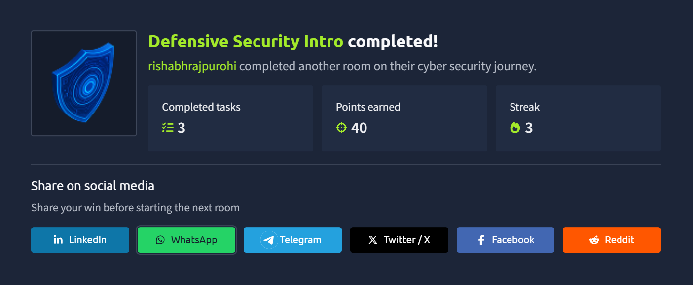
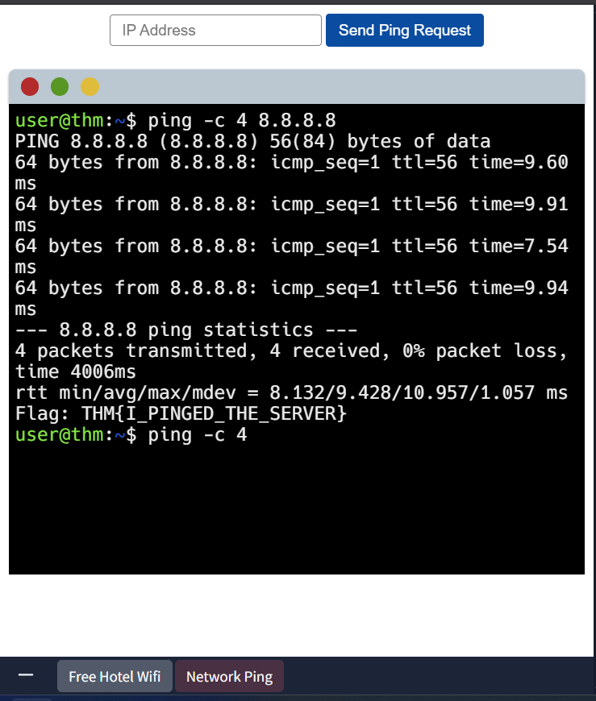

# TryHackMe: Defensive Security Intro

## Some of that task that are related to defensive security

1. User cyber security awarness
1. Documenting and manging assets
1. Updating and Patching system
1. Setting up login and monitoring devices
1. Setting up preventing security devices

## 🛡️ The Mindset: Defense in Depth

Don't rely on one "big wall." Use multiple layers of security to slow down an attacker.

1. **Firewall:** The first line of defense (Inbound/Outbound control).
2. **Authentication:** Proving **who** you are (Passwords/MFA).
3. **Authorization:** Deciding **what** you can do (The fix for the FakeBank IDOR vulnerability).
4. **Logging:** The "Black Box" of the server. Essential for post-attack investigation.

> **Key Lesson:** An attacker only has to be right once. A defender has to be right every single time.

---

## 🚦 Traffic Flow & Firewalls

- **Inbound Traffic:** Outside -> Inside. Defenders use **IPS (Intrusion Prevention Systems)** here to block malicious scans.
- **Outbound Traffic:** Inside -> Outside. Monitoring this helps detect **Exfiltration** (data theft).
- **Firewall Logic:** **"Default Deny"** — Block everything by default, only allow what is necessary.

---

## 🕵️ Identifying the Attack (SOC Analysis)

**Scenario:** FakeBank Web Server Logs.

- **Observation:** Massive volume of **404 Not Found** errors from a single IP.
- **Attack Type:** **Directory Brute-Forcing / Fuzzing**.
- **Discovery:** Attacker found `/bank-transfer` (Status 200).
- **Response:** Add an **Inbound Rule** to the firewall to block the Attacker's IP address.

### Security Operations center (SOC)

The security operations and center is a team of cyber security professionals that monitors and its system to detect malicious activity/ cyber security events. some of the main area of SOC are:

1. Vulerability
1. Network Intrusion
1. Policy violation
1. Unauthorized activity

