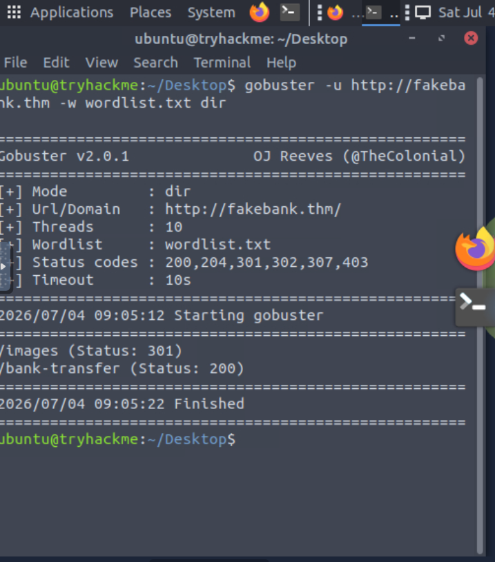
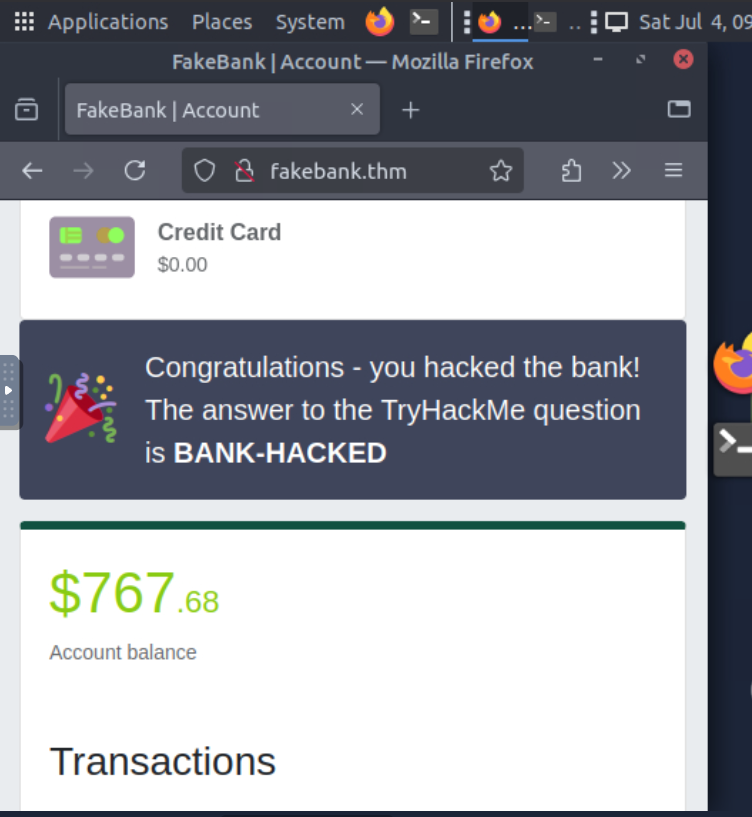

# Offensive Security Intro

This ia the core of "Offensive Security". it invloves breaking into computer systems, exploiting software bugs, and finding loopholes in application to gain unauthorized access.

- **Goal:** The goal is to understand hacker tactics and enhance or system defences.

## Hacking first machine

Inthis lesson, we have prepared a fake bank application called FakeBank.

- Command-line application called "Gobuster" to brute-force FakeBank's website to find hidden directories and pages.

- Gobuster will take a list of potential page or directory names and try accessing website each of them; if pages exists, it tell you.

gobuster -u https://fakebank.thm -w wordlist.txt dir

1. -u is used to state the website we're scanning
1. -w takes a list of word to iterate through to find hidden pages.

## Status Code,Meaning,Aapka Action

1. **200:** **Success!** , Browser mein check karo.
1. **403:** **Access Denied** ,Permission bypass try karo.
1. **301:** **Redirect** ,Check karo kahan bhej raha hai.
1. **404:** **Not Found** ,Ignore karo.
1. **500:** **Server Error** ,Server code mein kuch gadbad hai (kabhi-kabhi ye bhi vulnerability hoti hai).

