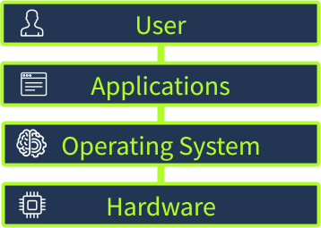
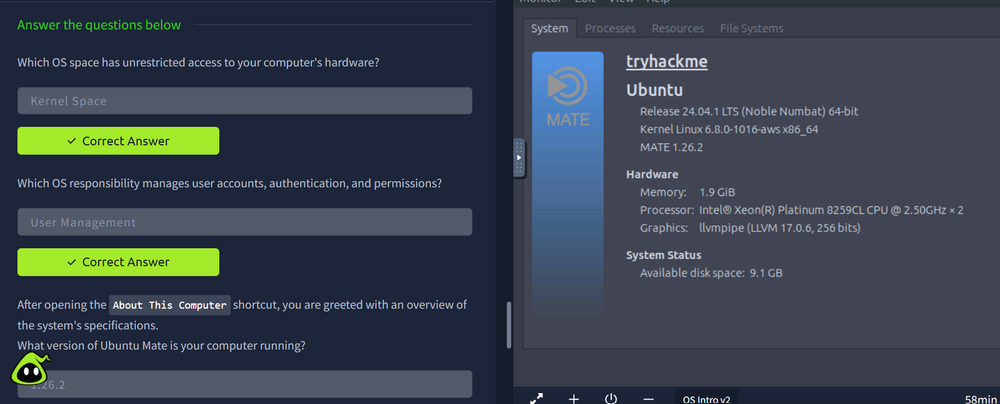

# Operating System

## The Invisible Manager

**Operating System (OS)** is a layer between the hardware and the applications. From the application's perspective, the OS provides an interface to access the different hardware components, such as CPU, RAM, and disk storage. Examples of OS are Android, FreeBSD, Linux, macOS, and Windows.

- Your **hardware** (CPU, RAM, storage, connected devices): The runways, airplanes, fuel systems, radar, and other physical infrastructure.
- Your **applications** (web browser, game launcher): The various airlines and their passengers, all trying to take off, land, and request services.
- Your **operating system (Windows, Linux, macOS)**: The entire air traffic control system, directing all of this activity. It schedules resources, manages traffic, resolves conflicts, and ensures safety.

### System Privilege Layers

- **Kernel space:** The privileged, locked-down core of the OS. This is where the kernel, the part of the operating system that directly manages hardware and system resources, runs. It has unrestricted access to the CPU, memory, storage, and all hardware components.
- **User space:** Where all standard applications run. Applications in the user space are deliberately prevented from accessing hardware directly. Whenever they need to open or save a file, play a sound, or connect to Wi-Fi, they must make a system call and request that the kernel act on their behalf.

### OS Responsibility

1. Precess Management
1. Memory Management
1. File System Management
1. User Management
1. Device Management

### Operating System Security

1. **Authentication:** Verifies who you are through login passwords and biometrics
1. **Permissions:** Controls exactly what each user and app is allowed to read, write, or execute
1. **Isolation:** Keeps every process in its own protected box (kernel/user space separation)
1. **System Protection:** Safeguards critical system files and settings from unauthorized changes

## OS interface

**GUI:** The graphical user interface, or GUI, is a form of user interface that allows users to interact with electronic devices through graphical icons and audio indicators such as primary notation, instead of text-based UIs, typed command labels or text navigation. GUIs were introduced in reaction to the perceived steep learning curve of command-line interfaces (CLIs),which require commands to be typed on a computer keyboard.

**CLI:** The command-line interface, or CLI, allows users to interact with a computer by typing text-based commands. Rather than clicking icons or menus, users enter commands using a keyboard to perform tasks. CLIs are commonly used for their speed, flexibility, and control.

### Operating system type

1. Desktop
1. Server
1. Mobile
1. Embedded
1. Virtual/Cloud

### Desktop

1. **Windows:** The most widely used operating system on personal computers
Windows 10 (end-of-life), Windows 11
1. **macOS:** Apple's desktop OS, known for its polished GUI and integration with other Apple devices
Sonoma (14), Sequoia (15), Tahoe (26)
1. **Linux** Not a single OS but a family of open-source operating systems called distributions
Ubuntu, Debian, Fedora.

### Server

1. **Windows:** Used in large networks, data centers, and corporate environments
Server 2016, 2019, 2022, 2025
1. **Linux:** The vast majority of web servers, trusted for its reliability and open-source nature
Ubuntu Server, Debian, CentOS, Red Hat
1. **Unix:** Large enterprises, finance, telecom, government
IBM AIX, Oracle Solaris

### Mobile

1. **Android:** The most widely used mobile OS, which runs on phones, tablets, and smart devices
Android 14 - 16, Manufacturer versions
1. **iOS:** Apple's mobile OS running on iPhones, iPads, and other devices
iOS 17, 18, 26

### Embedded and IoT Devices

1. **Embedded Linux:** Specialized OS built into devices with dedicated functions
OpenWrt, Ubuntu Core, Yocto Project
1. **Real-Time OS:** Designed for apps where tasks need guaranteed response times (aircraft controls)
FreeRTOS, VxWorks, QNX
Virtual and Cloud

1. **Cloud/VM:** Massive data centers that host websites, apps, and streaming services
Ubuntu LTS, Amazon Linux, Rocky Linux
1. **Container-optimized:** Lightweight alternatives to VMs that package just the app and its dependencies
Alpine Linux, Bottlerocket AWS, Flatcar Linux

### Why sp many operating system

Different devices and environments require different capabilities from an OS. A laptop must be user-friendly and support multitasking
